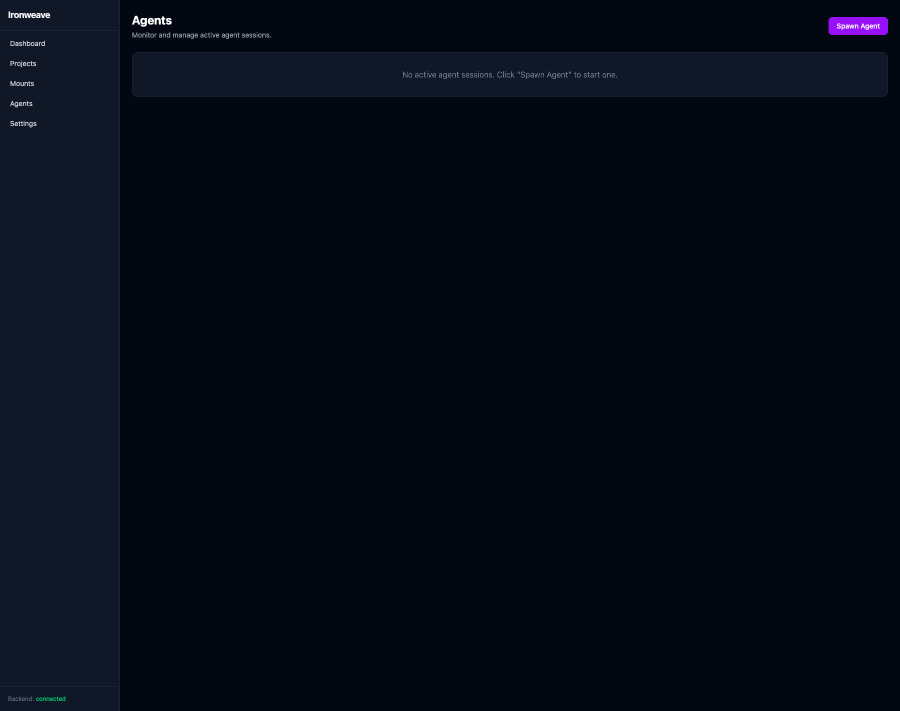

# Ironweave

Agent orchestrator platform for managing AI coding agents across projects. Import a plan, define teams, and let autonomous agents work through issues in isolated git worktrees — with live terminal streaming and a dependency-aware dispatch engine.



## What It Does

- **Plan Import** — Drop in a markdown plan file and Ironweave creates a dependency chain of issues automatically
- **Team-Based Dispatch** — Define teams with agent slots (roles, models, concurrency) and the orchestrator assigns work based on readiness
- **Isolated Worktrees** — Each agent gets its own git worktree branch, preventing conflicts between parallel agents
- **Live Terminals** — Watch agents work in real-time via WebSocket-streamed PTY sessions
- **Intake Decomposition** — Large issues get broken down by intake agents into smaller, actionable child tasks
- **Multi-Runtime** — Supports Claude Code, Gemini CLI, and OpenCode as agent runtimes
- **Remote Projects** — Mount remote codebases via SSHFS and manage them like local projects
- **Merge Queue** — Completed agent work flows through a merge queue back to the main branch

## Architecture

```
Svelte 5 SPA  ──▶  Axum 0.8 API  ──▶  SQLite (rusqlite)
                        │
                   Orchestrator (30s sweep loop)
                   ├── Intake decomposition
                   ├── Team dispatch
                   └── Merge queue
                        │
                   Agent Runtimes (PTY)
                   ├── Claude Code
                   ├── Gemini CLI
                   └── OpenCode
```

- **Backend**: Rust + Axum 0.8, SQLite via rusqlite, portable-pty for agent processes
- **Frontend**: Svelte 5 SPA, embedded into the binary via RustEmbed at compile time
- **TLS**: Self-signed certificates via axum-server with rustls

## Getting Started

### Prerequisites

- Rust toolchain (edition 2024)
- Node.js 18+ (for frontend build)
- Git

### Build

```bash
# Build frontend
cd frontend && npm install && npm run build && cd ..

# Build backend (embeds frontend assets)
cargo build --release
```

### Configure

```bash
cp ironweave.toml.example ironweave.toml
# Edit ironweave.toml — set TLS cert paths, data directory, etc.
```

### Run

```bash
./target/release/ironweave
```

Serves the UI and API on `https://0.0.0.0:443` by default.

### API Health Check

```bash
curl -sk https://localhost/api/health
# → "ok"
```

## Project Structure

```
src/
├── api/            # Axum route handlers
├── orchestrator/   # Sweep loop, plan parser, context injection
├── models/         # SQLite models (issues, projects, teams, agents)
├── worktree/       # Git worktree + merge queue management
├── mount/          # SSHFS remote mount manager
├── runtime/        # Agent runtime adapters (Claude, Gemini, OpenCode)
├── process/        # PTY process manager
├── sync/           # Jujutsu sync manager
├── app_runner/     # Project app preview (detect + run)
├── auth/           # Authentication middleware
├── db/             # Migrations and seeds
└── main.rs         # Server startup, routing, TLS

frontend/
├── src/routes/     # Svelte pages (Dashboard, Projects, Agents, etc.)
└── src/lib/        # Components (Terminal, IssueBoard, DagGraph, etc.)

deploy/             # systemd service, example config, build script
docs/plans/         # Design docs and implementation plans
```

## Key Concepts

| Concept | Description |
|---------|-------------|
| **Project** | A codebase Ironweave manages — local directory or remote mount |
| **Issue** | A unit of work with status, role, priority, and dependencies |
| **Team** | A group of agent slots that process issues for a project |
| **Agent Slot** | A seat on a team: defines role, runtime, model, and concurrency |
| **Agent** | A running process (Claude/Gemini/OpenCode) working on an issue |
| **Worktree** | An isolated git branch where an agent does its work |
| **Plan** | A markdown file with `### Task N:` headings that imports as issues |

## License

MIT
